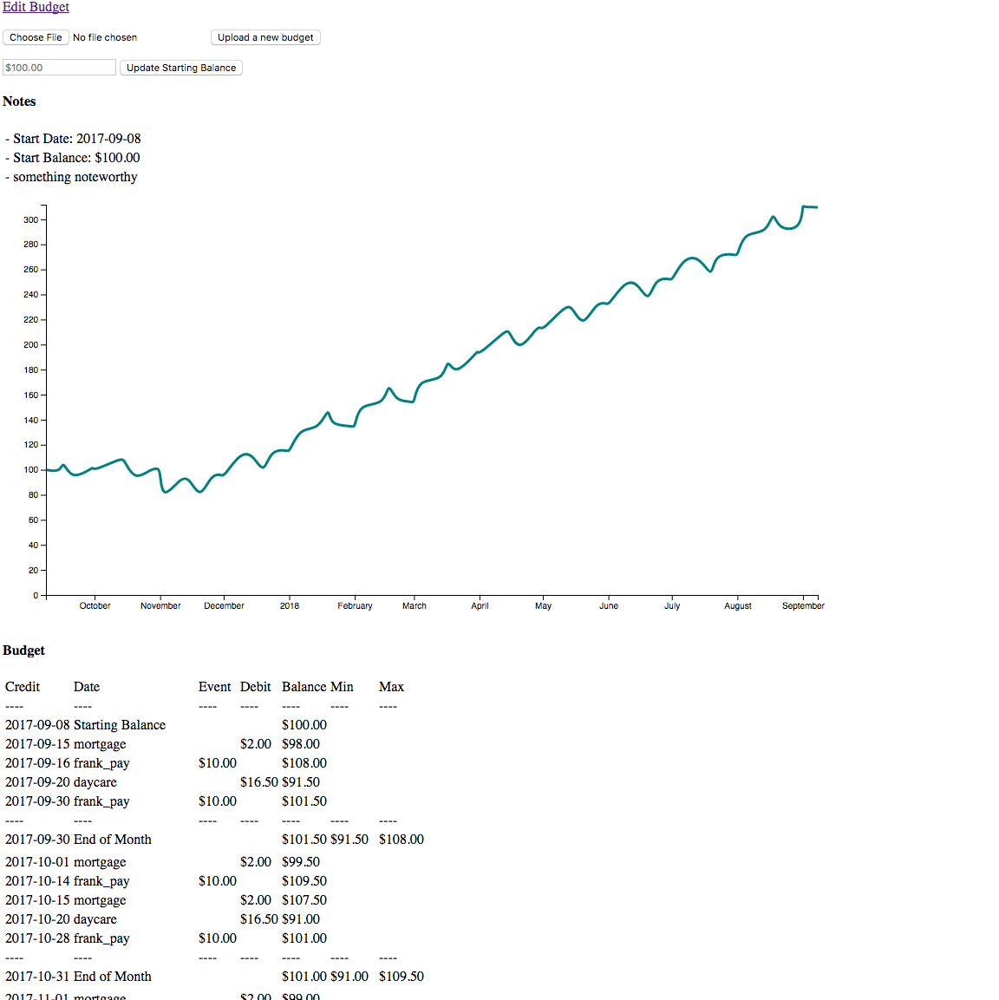

[](https://travis-ci.org/fdm1/financier)

Financier
=========

Generate a simulated budget for the next year to make sure you
don't run out of money.


Requirements
------------

* docker
* docker-compose (v2)


Usage
-----

1. Spin up the app:

    ```bash
    docker-compose up
    ```

1. Go to http://localhost:5000

1. Upload a budget yaml (budget construction in UI is planned)

1. Set your current balance in the UI


See it in action!
-----------------

Using the `sample_budget.yaml` with a starting balance of $100, the app shows this budget:

(The yaml can be found in `docs/resources/sample_budget.yaml`)




Budget Configs
--------------

### Config yaml format:

```
notes:
  - note 1
  - note 2

budget_events:
  <event_name>:
    amount: <amount>
    kind: <kind: [one_time | bimonthly | biweekly | monthly]
    start_date: <date (YYYY-MM-DD) default: today>
    day_of_month: <day>
    end_date: <date (YYYY-MM-DD>
  <event_name>:
    amount: <amount>
    kind: <kind: [one_time | bimonthly | biweekly | monthly]
    start_date: <date (YYYY-MM-DD) default: today>
    day_of_month: <day>
    end_date: <date (YYYY-MM-DD>
  (etc...as many events as you need)...
```

### `budget_event` kinds:

How different events work and what paramters do what.

If a parameter isn't listed below a `kind`, it has no effect.

`kind`:
  - `one_time`: a one time transaction
    - `exact_date`: date money will take effect
  - `bimonthly`: money will take effect on 1st and 15th
    - `start_date`: money will not move before this date
    - `end_date`: money will not move after this date
  - `biweekly`: money takes effect every 14 days
    - `start_date`: money will not move before this date
    - `example_date`: used to calculate if date is multiple of 14 days before/after a given date
    - `end_date`: money will not move after this date
  - `monthly`:
    - `start_date`: money will not move before this date
    - `day_of_month`: what day of the month to move money (avoid after the 28th as end of month dates not fixed yet)
    - `end_date`: money will not move after this date

